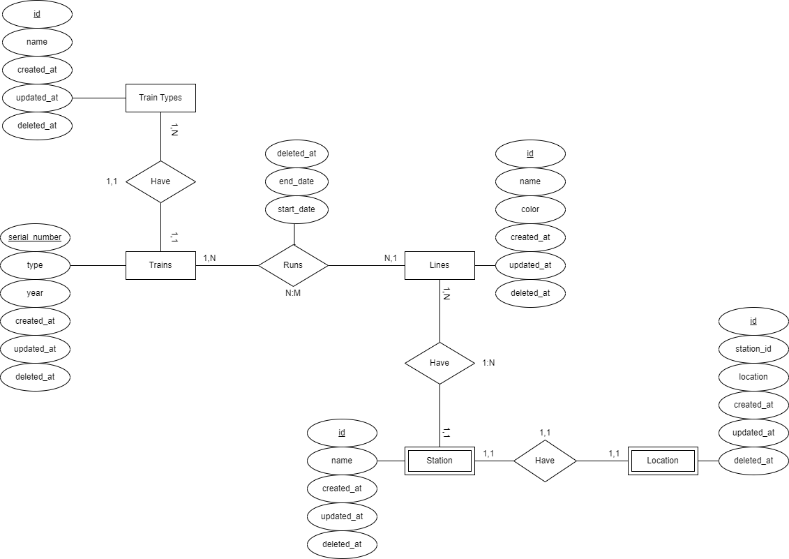
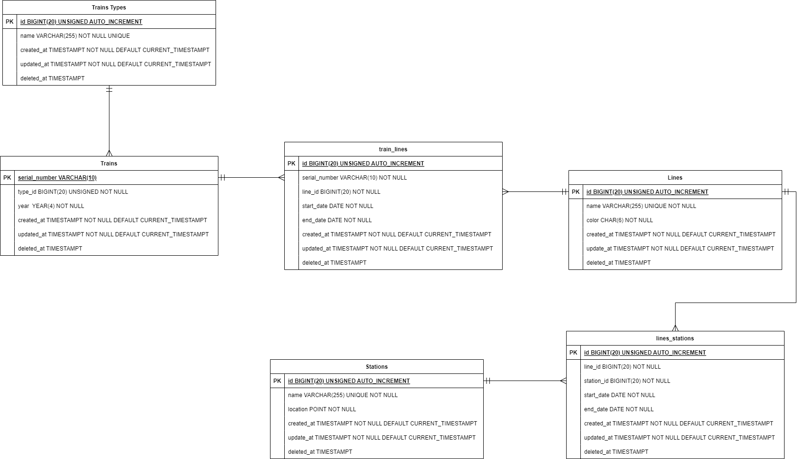

# Metro - MariaDB

Proyecto de creación de base de datos del metro usando MariaDB o MySQL

## ⚙️ Requisitos del proyecto

Requisitos para poder ver el resultado final del proyecto.

### ⚠️ Obligatorio

+ [MariaDB](https://mariadb.org/download/?t=mariadb&p=mariadb&r=11.0.0&os=windows&cpu=x86_64&pkg=zip&m=fe_up_pt)

### 🚸 Opcional

+ [HeidiSQL](https://www.heidisql.com/download.php)

## 🗃️ Documentación

### 💭 Diagrama Conceptual

### ✏️ Diagrama Fisico

